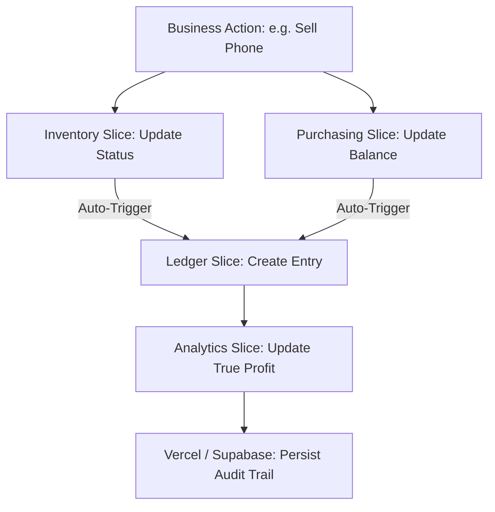

# 🏛 stockflow Architecture Overview

This document outlines the technical design principles and data flows that power the stockflow platform.

---

## 💎 Design Philosophy: 🛡 Integrity Above All
The platform follows an **Event-Driven Audit Model**. Rather than relying on manual bookkeeping, the system is designed to automatically generate a financial paper trail for every business event.

---

## 🧩 State Management (Redux Architecture)

The application state is centralized in a **Persisted Single Store**.

### 1. Data Slices
- **`inventory`**: Tracks individual items (IMEIs), their status (Stock/Sold/Repair), and cost basis.
- **`ledger`**: The source of truth for all cash movement. Automated via `extraReducers`.
- **`purchasing`**: Manages PO lifecycles and supplier reconciliations.
- **`sync`**: Tracks the online/offline status of transaction batches.

### 2. The Persistence Layer
We use `redux-persist` with `localforage` (IndexedDB). 
- **User Impact**: Even if the app crashes or the browser is refreshed, your local data remains intact.
- **Dev Impact**: Hydration occurs on boot; slices must handle `REHYDRATE` actions if custom logic is required.

---

## ⚡ High-Performance UI Patterns

### The Passive Ref Pattern (`ImeiScannerModal.tsx`)
To achieve a "flawless" scanning experience, we avoid standard React `useState` for high-frequency scanning indicators.

**The Problem**: Updating React state every 800ms during OCR causes the `<video>` element to re-render, leading to a "blink" or flicker in the feed.

**The Solution**:
1.  **Ref-Based Logic**: Scanning states are tracked in a `useRef`.
2.  **Direct DOM Manipulation**: The "OCR Active" badge and other HUD elements are updated directly via `ref.current.style.opacity`.
3.  **Result**: The video feed remains 100% stable at 60fps while the AI runs in the background.

---

## ☁️ Backend Interface (Supabase)

stockflow uses Supabase for global data persistence and authentication.

### Sync Strategy
1.  **Local First**: Actions are committed to the Redux store immediately.
2.  **Middleware Sync**: `supabaseMiddleware.ts` listens for specific actions and pushes changes to the cloud.
3.  **Conflict Resolution**: The `sync` slice tracks pending payloads and retries them when a network connection is restored.

---

## 📈 Financial Data Flow

### Key Logic: The Financial Watchtower
Inside `ledger/slice.ts`, we use `extraReducers` to automatically catch actions from other slices:
- `purchasing/rejectPO` → Automatically logs a "Refund Due" ledger entry.
- `inventory/repairItem` → Automatically logs a "Repair Cost" ledger entry.

---

## 🛠 Extension Points
- **Adding a Feature**: Create a feature folder in `src/features/` and register the slice in `src/app/store.ts`.
- **Modifying Analytics**: Analytics calculations derive data from the `ledger` slice, not raw sales data, to ensure all hidden costs (fees, repairs) are captured.
